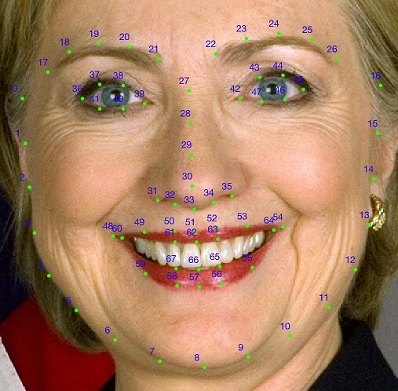
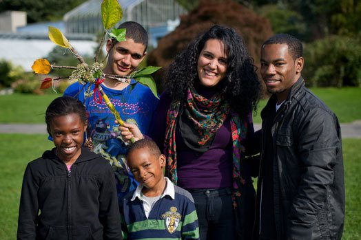
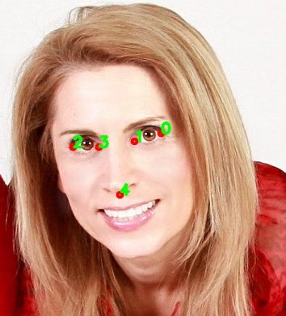
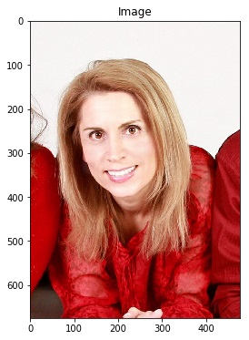
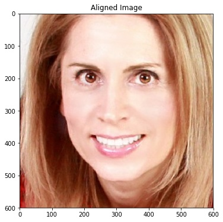
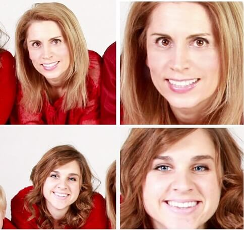

## **DLIB**

 

Dlib is an open source Machine Learning Library written in C++ with python binding. It is extremely portable and can be used on multiple platforms (including mobiles). Written by Davis King. 

DLib can do all of these!

- GUI
- Optimization
- Data Structures
- Machine Learning
  - deep learning
  - structured prediction
  - regression
  - clustering
- Text Parsing
- Linear Algebra
- Networking
- Image Processing
  - image io
  - object detection
  - feature extraction
  - filtering

 

## **DLib's 68-points Model**

 

 

The image below shows all the landmarks and their corresponding indices in Dlib’s array. In many applications we are concerned with use only a few facial landmarks. In those cases, the figure below can be used for quick reference. In this notebook, we will show how to detect these points, plot them on a face image and save them to file.



 

**Facial Landmark Detection** in DLib is done in two steps:

- In the first step, you need to detect the face in an image. For best results we should use the same face detector used in training the landmark detector. The output of a face detector is a rectangle (x, y, w, h) that contains the face. 

- DLib's face detector is based on HOG features and SVM. 

  

### **Facial Landmark Detection Code**

In this section we will go step by step over the code for facial landmark detection on an image and save the results to disk.

```
import dlib
import cv2
import numpy as np
from renderFace import renderFace
```

 

```
import matplotlib.pyplot as plt
%matplotlib inline
```

 

```
import matplotlib
matplotlib.rcParams['figure.figsize'] = (6.0,6.0)
matplotlib.rcParams['image.cmap'] = 'gray'
```

 

```
def writeLandmarksToFile(landmarks, landmarksFileName):
  with open(landmarksFileName, 'w') as f:
    for p in landmarks.parts():
      f.write("%s %s\n" %(int(p.x),int(p.y)))

  f.close()
```

Download the 5-pt alignment and 68-pt alignment files from this [source (Links to an external .)](https://drive.google.com/drive/folders/1WnMlKE0AjBp8ILL1Ht3GsgEInyk-fSG6)

```
# Landmark model location
PREDICTOR_PATH = MODEL_PATH + "shape_predictor_68_face_landmarks.dat"
```

##  

### Initialize the Face detector

Dlib has a built-in face detector which can be accessed using **get_frontal_face_detector()**. Notice that we did not have to specify a model file for Dlib’s face detector because the face detector is built into the code.

```
# Get the face detector instance
faceDetector = dlib.get_frontal_face_detector()
```

 

 

 

### Initialize the Landmark Predictor (a.k.a Shape predictor)

The **shape_predictor** class implements Dlib’s facial landmark detector. As the name suggests, it can be used to detect other landmark points ( e.g. the four corners of a credit card ) when trained to do so. Load the facial landmark detector model file. The information in the file makes the generic **shape_predictor** - a facial landmark detector.

```
# The landmark detector is implemented in the shape_predictor class
landmarkDetector = dlib.shape_predictor(PREDICTOR_PATH)

# Read image
imageFilename = DATA_PATH + "images/family.jpg"
im= cv2.imread(imageFilename)

# landmarks will be stored in results/family_i.txt
landmarksBasename = "results/family"
```

 

```
plt.imshow(im[:,:,::-1])
plt.show()
```



### Writing Facial Landmarks to Disk 

The landmarks are written to disk by accessing the x and y coordinates of the ith point using `landmarks.part(i).x()` and `landmarks.part(i).y()` respectively.

The code below shows how to write landmarks to a file. An output file stream is opened and the `(x, y)` coordinates of a point are written with a space in between them. Each row contains one point. Here we iterate over the parts of the landmarks and access the x and y coordinate as `p.x` and `p.y` respectively.

```
def writeLandmarksToFile(landmarks, landmarksFileName):
    with open(landmarksFileName, 'w') as f:
        for p in landmarks.parts():
            f.write("%s %s\n" %(int(p.x),int(p.y))) 
    f.close()
```

####  

#### **References and Further Reading**

- [http://blog.dlib.net/2014/08/real-time-face-pose-estimation.html (Links to an external site.)](http://blog.dlib.net/2014/08/real-time-face-pose-estimation.html)
- [http://dlib.net/face_landmark_detection_ex.cpp.html (Links to an external site.)](http://dlib.net/face_landmark_detection_ex.cpp.html)
- [http://dlib.net/face_landmark_detection.py.html (Links to an external site.)](http://dlib.net/face_landmark_detection.py.html)
- [http://www.learnopencv.com/facial-landmark-detection (Links to an external site.)](http://www.learnopencv.com/facial-landmark-detection)
- [http://www.pyimagesearch.com/2017/04/03/facial-landmarks-dlib-opencv-python (Links to an external site.)](http://www.pyimagesearch.com/2017/04/03/facial-landmarks-dlib-opencv-python)
- [https://developers.google.com/vision/ (Links to an external site.)](https://developers.google.com/vision/)

 

# **Face Alignment**

**Overview** 

In the previous chapter, we discussed about the 68 point model and its use cases. The first application we talked about was Face Alignment, which is helpful in Face recognition systems. In this chapter we will discuss about a new 5-point landmark detector released by dlib and also how to perform Face Alignment using the model.

 

### 5-point landmark detector in Dlib

In the new 5-point model, the landmark points consists of 2 points at the corners of the eye; for each eye and one point on the nose-tip. It is shown in the image given below.



###  

### Face Alignment Code

In this section we will go over the code used for face alignment using the 5-point model.

First, load the image and landmark model. We will then compute the landmarks.


Download the 5-pt alignment and 68-pt alignment files from this [source (Links to an external .)](https://drive.google.com/drive/folders/1WnMlKE0AjBp8ILL1Ht3GsgEInyk-fSG6)

```
import math, sys
import dlib
import cv2
import numpy as np
import matplotlib.pyplot as plt

main_path = './'
```

 

```
import matplotlib
matplotlib.rcParams['figure.figsize'] = (6.0,6.0)
matplotlib.rcParams['image.cmap'] = 'gray'
```

 

```
# Landmark model location
PREDICTOR_PATH = MODEL_PATH + "shape_predictor_5_face_landmarks.dat"
```

 

```
# Get the face detector
faceDetector = dlib.get_frontal_face_detector()
# The landmark detector is implemented in the shape_predictor class
landmarkDetector = dlib.shape_predictor(PREDICTOR_PATH)
```

 

```
# Read image
im = cv2.imread(DATA_PATH + "images/face2.jpg")
```

 

```
plt.imshow(im[:,:,::-1])
plt.title("Image")
plt.show()
```



 

```
# Detect landmarks.
points = fbc.getLandmarks(faceDetector, landmarkDetector, im)
```

 

```
points = np.array(points)
```

 

```
# Convert image to floating point in the range 0 to 1
im = np.float32(im)/255.0
```

Specify the size of the aligned face image. Compute the normalized image by using the similarity transform.

 

```
# Dimensions of output image
h = 600
w = 600
```

 

```
# Normalize image to output coordinates.
imNorm, points = fbc.normalizeImagesAndLandmarks((h, w), im, points)
```

 

```
imNorm = np.uint8(imNorm*255)
```

 

```
# Display the results
plt.imshow(imNorm[:,:,::-1])
plt.title("Aligned Image")
plt.show()
```



 

### Image Alignment Code 

This is the function that performs the alignment.

It Normalizes a facial image to a standard size given by `outSize`. The normalization is done based on Dlib’s landmark points passed as `pointsIn`.

After the normalization the left corner of the left eye is at `(0.3 * w, h/3 )` and the right corner of the right eye is at `( 0.7 * w, h / 3)` where `w` and `h` are the width and height of outSize.

It also checks if the model is a 68 point model or 5 point model.

```
def normalizeImagesAndLandmarks(outSize, imIn, pointsIn):
  h, w = outSize

  # Corners of the eye in input image
  if len(pointsIn) == 68:
    eyecornerSrc = [pointsIn[36], pointsIn[45]]
  elif len(pointsIn) == 5:
    eyecornerSrc = [pointsIn[2], pointsIn[0]]

  # Corners of the eye in normalized image
  eyecornerDst = [(np.int(0.3 * w), np.int(h/3)),
                  (np.int(0.7 * w), np.int(h/3))]

  # Calculate similarity transform
  tform = similarityTransform(eyecornerSrc, eyecornerDst)
  imOut = np.zeros(imIn.shape, dtype=imIn.dtype)

  # Apply similarity transform to input image
  imOut = cv2.warpAffine(imIn, tform, (w, h))

  # reshape pointsIn from numLandmarks x 2 to numLandmarks x 1 x 2
  points2 = np.reshape(pointsIn, 
                      (pointsIn.shape[0], 1, pointsIn.shape[1]))

  # Apply similarity transform to landmarks
  pointsOut = cv2.transform(points2, tform)

  # reshape pointsOut to numLandmarks x 2
  pointsOut = np.reshape(pointsOut, 
                          (pointsIn.shape[0], pointsIn.shape[1]))

  return imOut, pointsOut
```

 

What does similarity transform do?

[LINK (Links to an external site.)](https://imgur.com/gallery/o0xqi)



 

### How to stabilize landmark points in a video

When you use Dlib’s Facial Landmark Detection on a video, you will notice they jiggle a bit. When the video is obtained under good and consistent lighting conditions, the landmarks tend to be more stable than when the lighting or imaging conditions are bad.

 


The most important reason for this instability is that the landmarks are detected in every frame independently. There is nothing that ties the information in one frame to the information in the next.

In this section, we will present a few strategies for stabilizing facial landmark points in videos. Depending on the algorithm we use for stabilizing the points, we will need up to four different pieces of information for stabilization

1. The location of a landmark in the current frame.
2. The location of the same landmark in the previous frame(s).
3. Pixels intensities in a small window in the current frame around the location of the landmark.
4. Pixels intensities in a small window in the previous frame around the location of the landmark.

**Note:** The methods we use are very general and can be applied to tracking points in general and not just facial landmarks.

 

### Optical Flow

In the methods described so far, only the location and velocity of the landmarks were used for tracking. However, because landmarks are points in an image, it makes sense to use a small patch around a landmarks in one frame to locate it in the next frame.

The technique we describe next is called Optical Flow and it uses pixel information for making a prediction.

[more visit site](https://www.sciencedirect.com/topics/engineering/optical-flow)

[and (openCV python)](https://opencv-python-tutroals.readthedocs.io/en/latest/py_tutorials/py_video/py_lucas_kanade/py_lucas_kanade.html)

  


# Running code

install requirements.txt

```
pip install -r requirements.txt
```

Want to run in Web Cam then specify

```
cap = cv2.VideoCapture(0)
```

Running on any video file give path 

```
path = './input_stabilize.avi'
cap = cv2.VideoCapture(path)
```

To close the window press hard key 'q' and space(32) for unsuitability point 

```
if cv2.waitKey(1) & 0xFF == ord('q'):
	showStabilized = not showStabilized
```


My Video

[](https://www.youtube.com/watch?v=kbxufPrOLuo)


